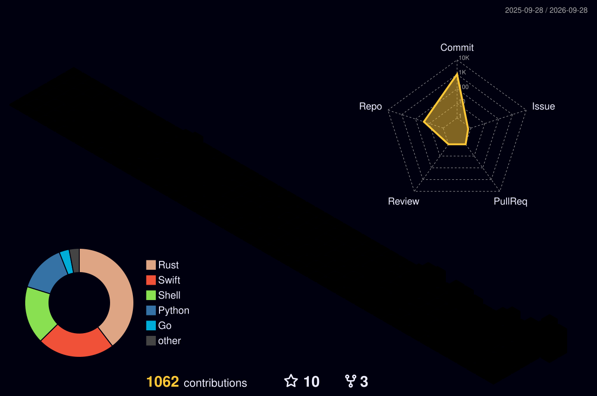

### Hi, I'm Ricky 👋

Developer & product designer. I build native apps and the tools I wish existed.

#### 📱 On the App Store

| App | What it does |
|---|---|
| [書房](https://apps.apple.com/app/%E6%9B%B8%E6%88%BF/id6798525550) | Ad-free novel, comic & RSS reader — paste a URL, read offline. No account, no tracking · [Website](https://shufang-reader.pages.dev/) |
| [Simple CF](https://apps.apple.com/tw/app/simple-cf/id6785373007) | Fast, native iOS & iPadOS client for your Cloudflare account |
| [AmbientSound](https://apps.apple.com/app/ambientsound/id6792389273) | Ink-wash styled white noise & sleep app — play and mix ambient sounds |
| [MiniGames](https://apps.apple.com/app/minigames/id6795174941) | Four childhood arcade games, redesigned for touch |

#### 🖥 Desktop Apps

| App | What it does |
|---|---|
| [MarkNote](https://marknote.pages.dev/) | Local-first WYSIWYG Markdown editor (Tauri, React, CodeMirror 6) |
| [Assistant](https://github.com/linzeyan/assistant) | Private, fully local AI assistant for Apple Silicon Macs |
| [DbClient](https://github.com/linzeyan/dbeaver) | Native rewrite of a DBeaver-class database client — Rust core, Metal grid, no JVM. ~35 databases from Postgres and MySQL to ClickHouse, DuckDB, MongoDB and Snowflake |
| [InputMethodEditor](https://github.com/linzeyan/InputMethodEditor) | Windows Chinese IME (Zhuyin & Pinyin) built on libchewing |
| [macshot for Windows](https://github.com/linzeyan/macshot) | Windows port of [macshot](https://macshot.io): annotate, record, OCR + translate, scroll capture |

Most install via Homebrew: `brew tap linzeyan/tools && brew install --cask <name>`

#### 🛠 Developer Tools

| Tool | What it does |
|---|---|
| [Poly](https://github.com/linzeyan/vscode-syntax) | One CLI + two VSCode extensions that replace a pile of per-language highlight / lint / format extensions |
| [formatter](https://github.com/linzeyan/formatter) | Multi-format file formatter CLI in pure Rust |
| [pm](https://github.com/linzeyan/proxy-manager) | CLI for managing v2ray / sing-box / xray |
| [redis-top-keys-analyzer](https://github.com/linzeyan/redis-top-keys-analyzer) | Find the biggest and hottest keys in Redis |
| [nginx](https://github.com/linzeyan/nginx) | Auto-built nginx / OpenResty `.deb` / `.rpm` packages, statically linked, tracking upstream releases |
| [file-format-viewer](https://github.com/linzeyan/file-format-extension) | Browser extension that pretty-prints and syntax-highlights raw data and config files |

CLIs install via Homebrew: `brew tap linzeyan/tools && brew install <name>`

#### 🌐 Web Tools

| Tool | What it does |
|---|---|
| [draft](https://draft-4w0.pages.dev) | Paste a SQL schema, get an ER diagram you can pan, zoom and edit — runs entirely in your browser |
| [transform](https://transforms.pages.dev) | Developer toolbox in Rust/WASM: UUID, JWT, hashes, JSON ⇄ YAML/TOML/XML, and more |
| [keybr 注音](https://keybr.pages.dev/) | Zhuyin (Bopomofo) typing trainer — a keybr.com fork that drills your weakest keys |

#### 🎨 Just for Fun

| Project | What it does |
|---|---|
| [PaperCut](https://papercutting.pages.dev) | Fold virtual paper, cut shapes, unfold to see the pattern, export as SVG |
| [Pintu](https://puzzle-coloring.pages.dev) | Turn any image into a coloring page or jigsaw puzzle |
| [Universe](https://universal-ex.pages.dev) | Animated solar system & Milky Way — rotation and orbits |

#### 📦 Libraries

- [loadconf](https://github.com/linzeyan/loadconf) — Go: declare a config struct, load it from files, environment variables and etcd
- [webp-go](https://github.com/linzeyan/webp-go) — Pure-Go WebP encoder (lossy, lossless, animation, alpha), no cgo

🗄 Earlier work

- [ops-cli](https://github.com/linzeyan/ops-cli) — A collection of useful tools for ops
- [block](https://github.com/linzeyan/block) — Block IPs manually or from Nginx logs
- [gpgen](https://github.com/linzeyan/gpgen) — Generate GraphQL or protobuf schema from model files
- [gd](https://github.com/linzeyan/gd) — Get DNS zones and records from AWS, Cloudflare, West
- [k8s_cluster](https://github.com/linzeyan/k8s_cluster) — Install a k8s cluster with just `vagrant up`

